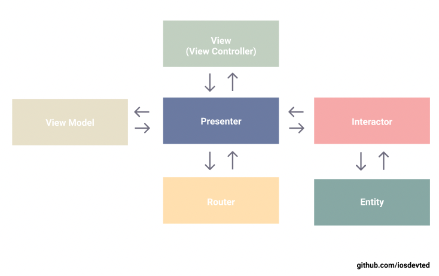
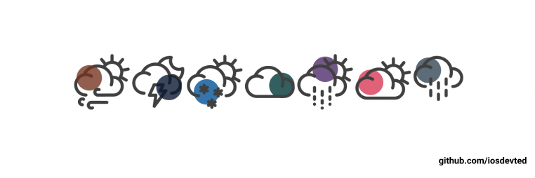

# ☔️ Weather App

  
  

## Minimalist Weather App

* Period : 11.08.2021 ~ 16.08.2021
* Design Pattern: VIPER
* Database: [Realm](https://github.com/realm/realm-cocoa)
* Tool: [Then](https://github.com/devxoul/Then)

### Design Pattern

### Structure

### Icons

### Git Commit Message Guide

- `feat`: A new feature
- `fix`: A bug fix
- `docs`: Changes to documentation
- `style`: Formatting, missing semi colons, etc; no code change
- `refactor`: Refactoring production code
- `test`: Adding tests, refactoring test; no production code change
- `chore`: Updating build tasks, package manager configs, etc; no production code change

