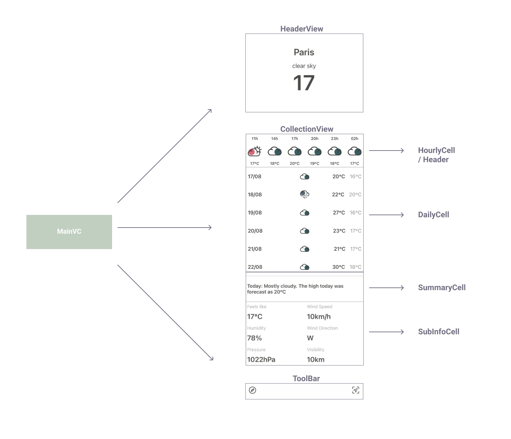

# ☔️ Weather App
> 11.08.2021 ~ 16.08.2021

<p>
  
  
  
</p>

### Design Pattern


`Interactor` — contains business logic related to the data (Entities) or networking, like creating new instances of entities or fetching them from the server. For those purposes you’ll use some Services and Managers which are not considered as a part of VIPER module but rather an external dependency.

`Presenter` — contains the UI related (but UIKit independent) business logic, invokes methods on the Interactor.

`Entities` — your plain data objects, not the data access layer, because that is a responsibility of the Interactor.

`Router` — responsible for the segues between the VIPER modules.

In this project, I used `view models` to tranform lots of data from the model and inject information to the view directly.

The VIPER architecture is based on the single responsibility principle (S.O.L.I.D.) which leads us to the theory of a clean architecture.

Using this architecture one can easily test at the boundaries between each layers. One feature, one module. For each module VIPER has five (sometimes six) different classes with distinct roles. VIPER makes the code easier to isolate dependencies and to test the interactions at the boundaries between layers.

### Structure





### API

[5 day weather forecast documentation](https://openweathermap.org/forecast5)

[Weather conditions documentation](https://openweathermap.org/weather-conditions#Weather-Condition-Codes-2)

[API Example](https://api.openweathermap.org/data/2.5/forecast?q=paris&APPID=da69ade359c47e35161bf2e2dad374e8&units=metric)

### Consideration

For the SOLID Principle(Dependency Inversion Principle), Should I write the code like below?

```swift
protocol NetworkRequest: AnyObject {
    associatedtype ModelType
    func decode(_ data: Data) -> ModelType?
    func load(withCompletion completion: @escaping (ModelType?) -> Void)
}

extension NetworkRequest {
    fileprivate func load(_ url: URL, withCompletion completion: @escaping (ModelType?) -> Void) {
        let session = URLSession(configuration: .default, delegate: nil, delegateQueue: .main)
        let task = session.dataTask(with: url, completionHandler: { [weak self] (data: Data?, response: URLResponse?, error: Error?) -> Void in
            guard error == nil else {
                return completion(nil)
            }
            
            guard let header = response as? HTTPURLResponse, (200..<300) ~= header.statusCode else {
                return completion(nil)
            }
            
            guard let data = data else {
                return completion(nil)
            }
            
            completion(self?.decode(data))
        })
        task.resume()
    }
}

protocol APIResource {
    associatedtype ModelType: Decodable
    var latitude: String { get }
    var longitude: String { get }
}

extension APIResource {
    var url: URL {
        
        let baseURL = "https://api.openweathermap.org/data/2.5/forecast"
        let API_KEY = ""
        
        var urlComponent = URLComponents(string: baseURL)
        
        urlComponent?.queryItems = [
            URLQueryItem(name: "APPID", value: "\(API_KEY)"),
            URLQueryItem(name: "lat", value: "\(latitude)"),
            URLQueryItem(name: "lon", value: "\(longitude)"),
            URLQueryItem(name: "units", value: "metric")
        ]
        
        return (urlComponent?.url)!
    }
}

struct WeatherResource: APIResource {
    typealias ModelType = WeatherResponse
    
    let longitude: String
    let latitude: String
}


class APIRequest<Resource: APIResource> {
    let resource: Resource
    
    init(resource: Resource) {
        self.resource = resource
    }
}

extension APIRequest: NetworkRequest {
    func decode(_ data: Data) -> (Resource.ModelType)? {
        do {
            let result = try JSONDecoder().decode(WeatherResponse.self, from: data)
            return result as? Resource.ModelType
        } catch {
            return nil
        }
    }
    
    func load(withCompletion completion: @escaping (Resource.ModelType?) -> Void) {
        load(resource.url, withCompletion: completion)
    }
}
```

### Git Commit Message Guide

- `feat`: A new feature
- `fix`: A bug fix
- `docs`: Changes to documentation
- `style`: Formatting, missing semi colons, etc; no code change
- `refactor`: Refactoring production code
- `test`: Adding tests, refactoring test; no production code change
- `chore`: Updating build tasks, package manager configs, etc; no production code change

### Third-Party Libraries

* Database: [Realm](https://github.com/realm/realm-cocoa)
* Tool: [Then](https://github.com/devxoul/Then)

### After `Code Review`

1. Indiscriminate use of Singleton is not good.
2. If I use local data, it is better to use it actively than to try to reduce its use.
3. I should also consider the possibility that data may be different in the process of saving it to local data. Therefore, if there is information to be brought from local data, it is better to bring all the information that way.
4. It is more effective to use observer than to use viewWillAppear.
5. If I think I don't need to use lazy var, I don't need to use it.
6. I need to think more about the effective method to implement something.