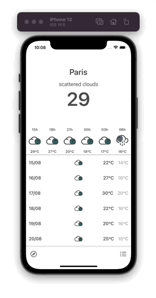
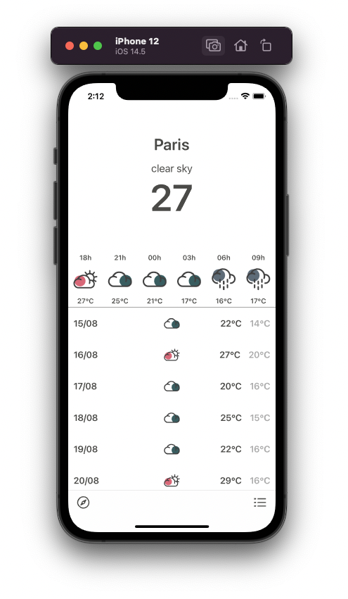
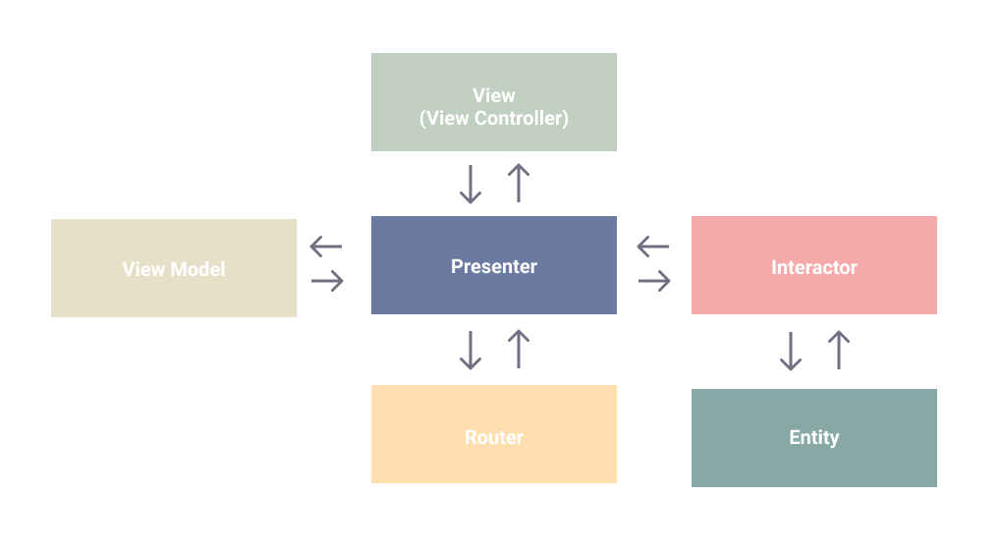
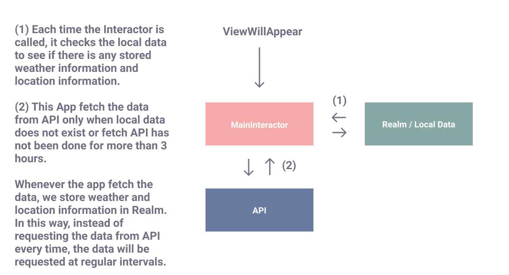
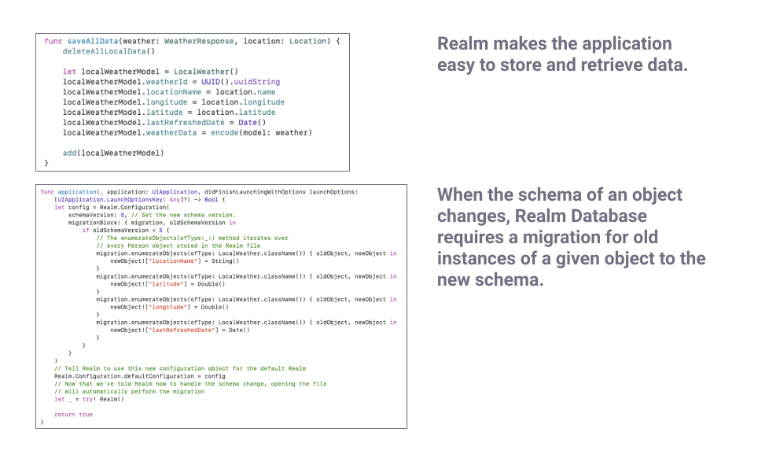
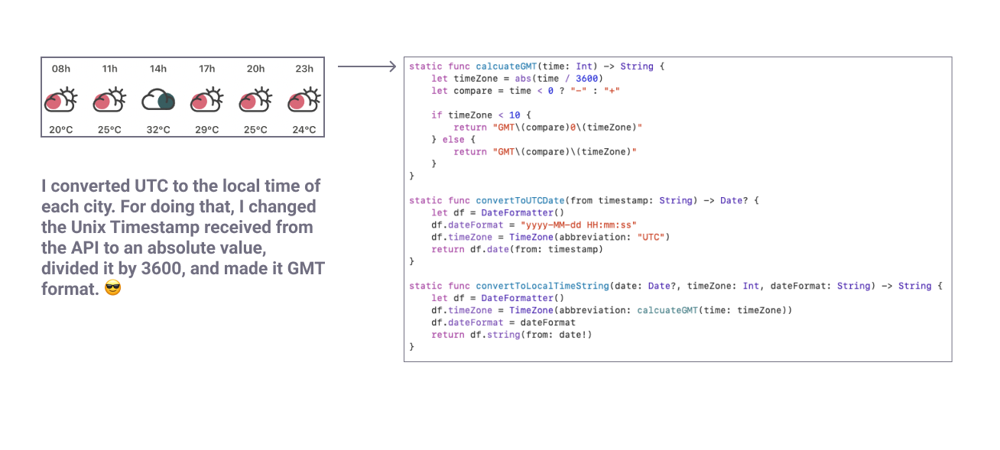
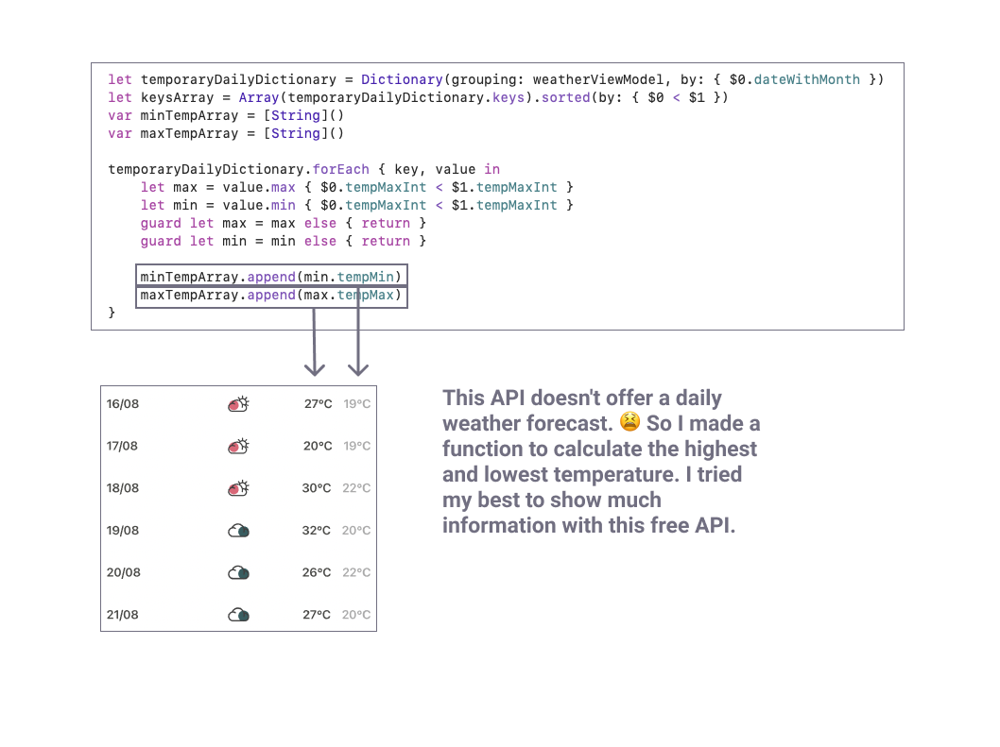
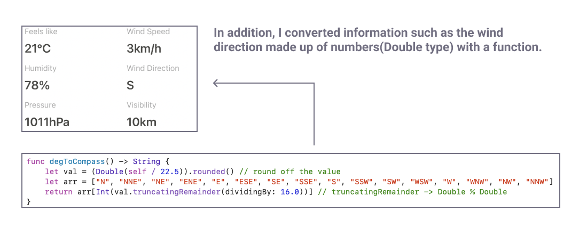
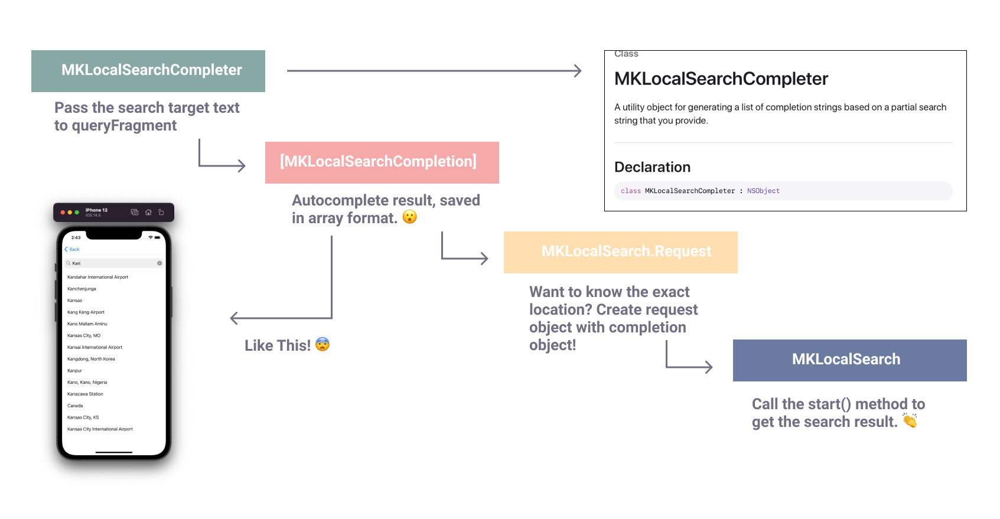

# ☔️ Weather App
> 11.08.2021 ~ 16.08.2021

  
  
  

### Design Pattern

`Interactor` — contains business logic related to the data (Entities) or networking, like creating new instances of entities or fetching them from the server. For those purposes you’ll use some Services and Managers which are not considered as a part of VIPER module but rather an external dependency.

`Presenter` — contains the UI related (but UIKit independent) business logic, invokes methods on the Interactor.

`Entities` — your plain data objects, not the data access layer, because that is a responsibility of the Interactor.

`Router` — responsible for the segues between the VIPER modules.

In this project, I used `view models` to tranform lots of data from the model and inject information to the view directly.

The VIPER architecture is based on the single responsibility principle (S.O.L.I.D.) which leads us to the theory of a clean architecture.

Using this architecture one can easily test at the boundaries between each layers. One feature, one module. For each module VIPER has six (sometimes four) different classes with distinct roles. VIPER makes the code easier to isolate dependencies and to test the interactions at the boundaries between layers.

### Structure

### API

[5 day weather forecast documentation](https://openweathermap.org/forecast5)

[Weather conditions documentation](https://openweathermap.org/weather-conditions#Weather-Condition-Codes-2)

[API Example](https://api.openweathermap.org/data/2.5/forecast?q=paris&APPID=da69ade359c47e35161bf2e2dad374e8&units=metric)

### Git Commit Message Guide

- `feat`: A new feature
- `fix`: A bug fix
- `docs`: Changes to documentation
- `style`: Formatting, missing semi colons, etc; no code change
- `refactor`: Refactoring production code
- `test`: Adding tests, refactoring test; no production code change
- `chore`: Updating build tasks, package manager configs, etc; no production code change

### Third-Party Libraries

* Database: [Realm](https://github.com/realm/realm-cocoa)
* Tool: [Then](https://github.com/devxoul/Then)
